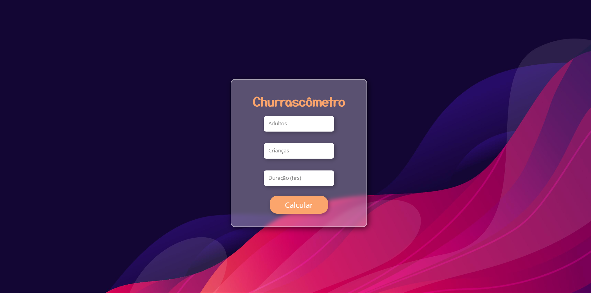
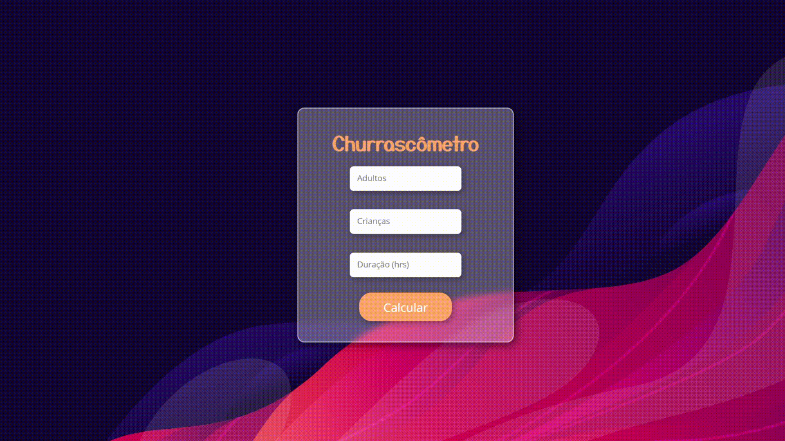

  <h1>Churrascômetro</h1>

  <h2>How to contact me:</h2>

# Objetivo:

  Esse é um projeto construído durante as aulas do curso de desenvolvimento Web do Programador BR.

Esse exercício foi desenvolvido para praticarmos os conceitos aprendidos no capítulo de JavaScript Itermediário, o qual aborda os principais conceitos de manipulação da DOM.

## Principais Aprendizados:

Nesse módulo aprendemos a manipular os objetos <strong> window</strong> e <strong>document</strong> para conseguir acessar elementos HTML diretamente do JS e fazer devidas modificações conforme necessário.

Além disso estudamos os Events da DOM, construindo funcionalidades e integração direta a elementos HTML por meio do JS durante um determinado "gatilho".

Também estudamos o conceito do <em> this </em>, trabalhamos com a bilioteca <em> Math </em> nativa do JS, entendemos as funcionalidades do objeto <strong> JSON</strong> (<em>parse</em> e <em> stringfy</em> ).

Por fim, estudamos também a persistênciad e dados por meio do <strong>Local Storage</strong> e a manipular o tempo e intervalo dentro do JavaScript com os métodos <strong>setTimeOut()</strong> e <strong>setInterval()</strong>.

De modo geral, o módulo foi bastante satisfatório para o aprendizado.

# Resultado do projeto:

Fiz algumas mudanças simples no Layout.
Utilizei das técnicas de <em>Glass Morphism</em> que estão em alta para dar o efeito de vidro na tela e desfocar o fundo. O Fundo utilizei uma imagem abstrata. Esse tipo de modelo de background me chama bastante a atenção. Gosto de cores fortes e contrastes puxados para o roxo, rosa, laranja e vermelho.

  

  

# Contribua com o projeto:

1. Faça um fork do projeto;

2. Crie uma branch para fazer suas modificações (`git checkout -b my-new-resource`);

3. Faça o commit (`git commit -am 'Adding a new resource...'`)

4. Faça o push (`git push origin my-new-resource`)

5. Envie um Pull Request

Projeto desenvolvido por <a href="https://www.linkedin.com/in/soaresmilton/"><strong>Milton Soares</strong> 
 </a>

